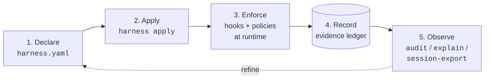

# harness

**Declarative control plane for agent harnesses.**

One zod-validated YAML manifest for grounding, tools, memory, hooks,
policies, and workflows, plus a CLI that describes, validates, diffs,
applies, audits, and *enforces*.

> Most config tools tell you what an agent is configured to use.
> `harness` tells you what an agent is *allowed to do*, under this
> exact context, and why.

A coding agent like Claude Code is configured across half a dozen
files: `settings.json`, `CLAUDE.md`, memory notes, MCP registrations,
hook scripts, per-project overrides. No single file answers *"what can
this agent do right now, and why is it set up that way?"*, so
configuration drifts between sessions, rules you wrote down in one
place quietly stop firing, and a broken tool is discovered only by
tripping over it.

`harness` puts all of that in one YAML file you can read, validate,
and diff. From that file it generates the config the agent actually
loads, and at runtime it enforces the rules you declared: it blocks a
tool call that violates one, and records every decision so you can
see what fired and why.

## See it work

One rule, declared in `harness.yaml`: *no session may merge a PR
until it has logged a review.*

Claude Code goes to merge PR 42. Before the tool call runs, the
runtime hands the event to `harness`, which checks it against the
manifest:

```console
$ harness policy intercept       # Claude Code runs this before each tool call
{"decision":"block","reason":"review-before-merge: no matching ledger entry for tag `review:42`","hookSpecificOutput":{"hookEventName":"PreToolUse","permissionDecision":"deny","permissionDecisionReason":"review-before-merge: no matching ledger entry for tag `review:42`"}}
```

Blocked. `harness explain` says exactly why:

```console
$ harness explain review-before-merge --trace
name: review-before-merge
decision: deny
enforcement: block
reason: no matching ledger entry for tag `review:42`
ledgerTag: review:42
extract:
  PR_NUMBER: "42"
requiresEval:
  matchedCount: 0
  reason: no matching ledger entry for tag `review:42`
# ... (trimmed; the full trace also shows the matched trigger, every extracted variable, and the ledger query)
```

The rule pulled `PR_NUMBER=42` out of the tool call and looked for a
`review:42` entry in the evidence ledger. There wasn't one. So the
reviewer (or a review subagent) logs that entry, and the *same* merge
call, retried, goes straight through, no restart, no config edit:

```console
$ harness policy intercept       # same call, after the review was logged
$                                # (no output, exit 0: allowed)
```

Every one of those decisions is recorded:

```console
$ harness audit --since 1h --policy review-before-merge
timestamp            policy               outcome  reason
-------------------  -------------------  -------  --------------------------------------------
2026-05-14 19:09:03  review-before-merge  deny     no matching ledger entry for tag `review:42`
2026-05-14 19:09:13  review-before-merge  allow    1 matching ledger entry for tag `review:42`
```

Declare the rule once; every session is held to it, with a paper
trail of every decision.

## Concepts in six lines

| Term | What it is |
|------|-----------|
| **manifest** | The one YAML file (`harness.yaml`) where you declare everything: tools, hooks, policies, memory. |
| **apply** | `harness apply` renders the manifest into the config files the agent runtime actually reads. |
| **policy** | A rule of the form *when the agent does X, require evidence Y*. Evaluated at runtime; can block the call. |
| **evidence ledger** | An append-only log of facts an agent records during a session. Policies check it; `audit` / `explain` replay it. |
| **hook** | A script the agent runtime runs at a lifecycle event (session start, before every tool call, ...). How policies get enforced. |
| **policy pack** | A reusable bundle of policies, hooks, and templates shipped under one name and enabled with a single manifest key. |

## What harness does



One manifest declares grounding, tools, memory, hooks, policies, and
workflows. `apply` materialises that into the files Claude Code
actually reads. At runtime, hooks and policies enforce the contract
and write decision rows to the evidence ledger. The read-side
surfaces (`audit`, `explain --trace`, `session-export`) replay those
rows so you can see what fired, why, and across which session.
Whatever you learn from observing flows back into the manifest. That
loop is the whole product.

## Pick your audience

- **Operator?** Read [`docs/for-humans.md`](docs/for-humans.md). It
  walks from `npm i -g @lannguyensi/harness` through your first
  `apply`, your first real policy, and the diagnostics cheat sheet.
- **Agent (or onboarding one)?** Read
  [`docs/for-agents.md`](docs/for-agents.md). It defines the
  workflow lifecycle, the policy / ledger sequence, the CLI cheat
  sheet split by side-effect class, and the audit triumvirate
  (`audit` vs `explain --trace` vs `session-export`).

## Install

```bash
npm i -g @lannguyensi/harness
```

The CLI binary is `harness`. Node 20 or newer required.

## First-time setup

In a hurry? [`docs/quickstart.md`](docs/quickstart.md) is the bare
command path, install to wired-in, no prose.

```bash
harness init --interactive
```

Guided wizard that detects your environment (existing `~/.claude/` and
`~/.codex/`, MCP servers already wired in `settings.json`, harness
binary version), picks a profile (`solo` / `team` / `custom`), and
writes a starting `harness.yaml`. Ctrl-C at any prompt aborts with no
partial write. Walkthrough + limitations: `docs/init-interactive.md`.

If you prefer non-interactive (CI, fresh-VM provisioning), pick a
template directly:

```bash
harness init --template solo   # memory-router + understanding-before-execution pack
harness init --template team   # solo + agent-tasks MCP + review-before-merge policy
harness init --template full   # everything from the Appendix A reference manifest
```

Debug what the harness sees in your env without writing anything:

```bash
harness init --probe   # JSON snapshot of detected runtimes + MCPs + manifest
```

## Try it yourself

The demo above shows the runtime path. To see policy matching without
installing anything or touching the ledger, run `dry-run` against the
reference manifest:

```bash
git clone https://github.com/LanNguyenSi/harness && cd harness
npm install && npm run build
node dist/cli/main.js dry-run "merge PR 42" \
  --tool mcp__agent-tasks__pull_requests_merge \
  --tool-args '{"prNumber":42}' \
  --config docs/examples/full-manifest.yaml
```

`dry-run` reads the reference manifest, runs the trigger matcher,
substitutes `${PR_NUMBER}=42` through the JSONPath-restricted extract
DSL, and tells you exactly which hooks would fire and which policies
would match, before any ledger I/O.

Convinced? Install globally and set up your own:
`npm i -g @lannguyensi/harness && harness init --interactive`.

## Status

harness ships in phases. Phases 1 through 6 are released: read-only
inventory → managed edits → declarative truth → policy layer → polish
and dogfood lessons → the Understanding Gate Policy Pack. Phase 7, the
Risk Gate, is next. The current release is `v0.11.0`.

The phase-by-phase plan with acceptance criteria lives in
[`docs/ROADMAP.md`](docs/ROADMAP.md); what shipped in each version is
in [`CHANGELOG.md`](CHANGELOG.md).

## Policy Packs

A *Policy Pack* is a reusable bundle of instruction template, hooks,
policies, and permission profiles that ships under one name and is
referenced from `harness.yaml` with a single key. The first pack,
`understanding-before-execution` (shipped in `v0.9.0`), forces agents
to expose and confirm their task interpretation before any
write-capable tool fires.

```yaml
policy_packs:
  - name: understanding-before-execution
    config:
      mode: grill_me                       # fast_confirm | grill_me | strict
      permission_profile: safe-start       # safe-start | implementation-after-approval | high-risk-grill-me
```

Manage packs with `harness pack add / remove / list`. Apply against
either runtime:

```sh
harness apply --runtime claude-code        # default; writes harness.generated/settings.json
harness apply --runtime codex              # writes harness.generated/codex/config.toml
```

Approve a session's Understanding Report via
`harness approve understanding --session <id>` (round-trips both the
evidence-ledger tag and the persisted JSON report). Verify the
adapter wiring with `harness doctor --target codex` (`--json` for
machine-readable). The full reference lives in
[`docs/policy-packs/understanding-before-execution.md`](docs/policy-packs/understanding-before-execution.md);
synthetic-stdin dogfood under
[`dogfood/phase6-6/`](dogfood/phase6-6/run-smoke.sh) exercises the
block / allow / capture / approve round-trip without a real Codex
binary.

## What's next

**Phase 7, Risk Gate.** Today's policy model evaluates a rule per
matching trigger and returns a binary block/allow. Phase 7 makes
harness reason about *the action itself*: an Action Envelope (tool +
raw input + session + runtime context) is enriched by a Context
Resolver (production / staging / dev / unknown), classified by a Risk
Classifier (severity + categories + reversibility), then matched
against policies whose `when:` clauses can reference
`risk.severity_at_least`, `environment.name`, and similar. The
decision space extends to `allow / warn / require_approval / deny`.
Motivating use case: prevent `DROP TABLE users`, `kubectl delete
namespace prod`, `terraform destroy` against an unverified production
target, even if the model would have happily run them.

Phase 7 builds on Phase 4's `policy intercept` runtime backbone and
Phase 6's Policy Pack distribution surface; neither is replaced.

> Bring your favorite agent harness. Add governance.

## Why this exists

A working agent harness today has six to eight configuration
surfaces, each with its own schema and lifecycle: `~/.claude/settings.json`,
`CLAUDE.md` (per repo + root), `~/.claude/projects/*/memory/*.md`
with frontmatter, `~/.claude/keybindings.json`, MCP server
registrations in `~/.claude.json`, skill directories, per-project
overrides, and external CLIs that behave differently per project.

There is no single place that answers *"what can this agent do right
now, and why is that configured that way?"*. Drift between sessions
is invisible until it breaks something. Humans editing one surface
do not know which other surfaces they need to touch. A fresh agent
instance has no way to audit its own setup.

Our entry point into this problem: on 2026-04-23, an
`agent-grounding` checkout that was 16 commits behind origin led two
tasks to be incorrectly called "stale". The check that would have
caught it already exists,
[`agent-preflight`](https://github.com/LanNguyenSi/agent-preflight)
runs `git fetch` + `git status` (alongside lint, typecheck, test,
audit) and emits a structured `ready` + confidence-score result. The
missing piece was not the check itself, it was the deterministic
*trigger*: a `SessionStart` hook that invokes `preflight run` and a
policy that gates further work on the result. Building that wiring
needs an agreed-upon place for harness config to live first. That
conversation is the origin of this repo.

## Related

- [`agent-grounding`](https://github.com/LanNguyenSi/agent-grounding):
  grounding primitives (evidence-ledger, claim-gate,
  review-claim-gate); `grounding-mcp` is the canonical client surface
  harness queries through `queryLedgerByTag`.
- [`agent-memory`](https://github.com/LanNguyenSi/agent-memory):
  memory surfaces the control plane inventories.
- [`agent-tasks`](https://github.com/LanNguyenSi/agent-tasks): the
  MCP-registered task platform whose registration + health appear in
  `harness describe`.
- [`agent-preflight`](https://github.com/LanNguyenSi/agent-preflight):
  local preflight validator; the canonical implementation of
  preflight-hook content harness wires.
- [`codebase-oracle`](https://github.com/LanNguyenSi/codebase-oracle):
  one of the MCP surfaces being registered.
- [`agent-dx`](https://github.com/LanNguyenSi/agent-dx): ships
  `git-batch-cli`, a day-to-day tool whose inventory appears in
  `harness describe`.

## License

MIT, see [LICENSE](LICENSE).
