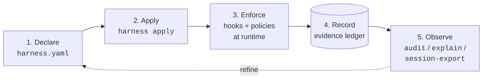

# harness

**Declarative control plane for agent harnesses.**

One zod-validated YAML manifest for grounding, tools, memory, hooks,
policies, and workflows, plus a CLI that describes, validates, diffs,
applies, audits, and *enforces*.

> Most config tools tell you what an agent is configured to use.
> `harness` tells you what an agent is *allowed to do*, under this
> exact context, and why.

A coding agent like Claude Code is configured across half a dozen
files (`settings.json`, `CLAUDE.md`, memory notes, MCP registrations,
hook scripts, per-project overrides), and no single file answers
*"what can this agent do right now, and why is it set up that way?"*.
`harness` puts all of it in one YAML you read, validate, and diff;
generates the config the agent loads from it; and at runtime blocks
tool calls that violate the declared rules while recording every
decision.

## See it work

One rule, declared in `harness.yaml`: *no session may merge a PR
until it has logged a review.*

Claude Code goes to merge PR 42. Before the tool call runs, the
runtime hands the event to `harness`, which checks it against the
manifest. The hook protocol wire shape is the legacy engine-vocabulary
envelope (operators see this on stderr; agents read it via
`permissionDecisionReason` when the policy declares no `ux:` block):

```console
$ harness policy intercept       # Claude Code runs this before each tool call
{"decision":"block","reason":"review-before-merge: no matching ledger entry for tag `review:42`","hookSpecificOutput":{"hookEventName":"PreToolUse","permissionDecision":"deny","permissionDecisionReason":"review-before-merge: no matching ledger entry for tag `review:42`"}}
```

Built-in block-enforcement policies ship a `ux:` block since v0.17.0,
so the agent sees a plain-language three-section form
([`docs/for-agents.md`](docs/for-agents.md#agent-facing-block-messages-ux-block));
the engine-vocabulary text above stays in the audit ledger.

Blocked. `harness explain` says exactly why:

```console
$ harness explain review-before-merge --trace
name: review-before-merge
decision: deny
enforcement: block
reason: no matching ledger entry for tag `review:42`
ledgerTag: review:42
extract:
  PR_NUMBER: "42"
requiresEval:
  matchedCount: 0
  reason: no matching ledger entry for tag `review:42`
# ... (trimmed; the full trace also shows the matched trigger, every extracted variable, and the ledger query)
```

The rule pulled `PR_NUMBER=42` out of the tool call and looked for a
`review:42` entry in the evidence ledger. There wasn't one. So the
reviewer (or a review subagent) logs that entry, and the *same* merge
call, retried, goes straight through, no restart, no config edit:

```console
$ harness policy intercept       # same call, after the review was logged
$                                # (no output, exit 0: allowed)
```

Every one of those decisions is recorded:

```console
$ harness audit --since 1h --policy review-before-merge
timestamp            policy               outcome  reason
-------------------  -------------------  -------  --------------------------------------------
2026-05-14 19:09:03  review-before-merge  deny     no matching ledger entry for tag `review:42`
2026-05-14 19:09:13  review-before-merge  allow    1 matching ledger entry for tag `review:42`
```

Declare the rule once; every session is held to it, with a paper
trail of every decision.

## Concepts in six lines

| Term | What it is |
|------|-----------|
| **manifest** | The one YAML file (`harness.yaml`) where you declare everything: tools, hooks, policies, memory. |
| **apply** | `harness apply` renders the manifest into the config files the agent runtime actually reads. |
| **policy** | A rule of the form *when the agent does X, require evidence Y*. Evaluated at runtime; can block the call. |
| **evidence ledger** | An append-only log of facts an agent records during a session. Policies check it; `audit` / `explain` replay it. |
| **hook** | A script the agent runtime runs at a lifecycle event (session start, before every tool call, ...). How policies get enforced. |
| **policy pack** | A reusable bundle of policies, hooks, and templates shipped under one name and enabled with a single manifest key. |

## What harness does



Observe → refine → declare is the whole loop. The read-side surfaces
(`audit`, `explain --trace`, `session-export`) replay rows the runtime
already recorded, so what flows back into the manifest is grounded in
what actually happened.

## Pick your audience

- **Operator?** [`docs/for-humans.md`](docs/for-humans.md): install through first `apply`, first real policy, diagnostics cheat sheet.
- **Agent (or onboarding one)?** [`docs/for-agents.md`](docs/for-agents.md): workflow lifecycle, policy / ledger sequence, CLI cheat sheet by side-effect class, the audit triumvirate.
- **Writing your own policy?** [`docs/writing-custom-policies.md`](docs/writing-custom-policies.md): three tripwires, four worked recipes (each validated in CI), author loop, field reference.
- **Guarding destructive runtime commands?** [`docs/runtime-reality-hook.md`](docs/runtime-reality-hook.md): block compose/systemctl/kill/deploy calls when the live process state has drifted from what the docs expect.
- **Looking up a CLI verb?** [`docs/CLI.md`](docs/CLI.md): every command the `harness` binary exposes, grouped by purpose (manifest, runtime, hooks, approvals, gates, preflight).

## Install

```bash
npm i -g @lannguyensi/harness
```

The CLI binary is `harness`. Node 20 or newer required.

## First-time setup

In a hurry? [`docs/quickstart.md`](docs/quickstart.md) is the bare
command path, install to wired-in, no prose.

```bash
harness init --interactive
```

Guided wizard. Detects `~/.claude/` and `~/.codex/`, MCP servers
already wired in `settings.json`, harness binary version. Picks a
profile (`solo` / `team` / `custom`) and writes a starting
`harness.yaml`. Ctrl-C aborts cleanly. Walkthrough +
limitations: [`docs/init-interactive.md`](docs/init-interactive.md).

### Profiles at a glance

| Profile | External accounts / tools required | Best for |
|---------|------------------------------------|----------|
| `solo`  | None. `npm` + Claude Code is enough. | Single operators who want the Understanding Gate without committing to a tasking system. |
| `team`  | An **agent-tasks** account ([hosted](https://agent-tasks.opentriologue.ai) or [self-hosted](https://github.com/LanNguyenSi/agent-tasks)). | Teams that already use `agent-tasks` for PR review tracking. The merge gate (`review:<pr-number>` ledger tag) wires against the agent-tasks MCP. |
| `full`  | Same as `team` plus `@lannguyensi/agent-preflight` and `gh` on PATH. | Operators who want every reference policy enforced (dogfood gate, preflight gates, review-subagent gate, merge gate). |

**Not using agent-tasks?** Pick `solo`. The `team` and `full` review gates currently match only the agent-tasks MCP tool names, so a `gh pr create` workflow stays unprotected by them today. Tool-agnostic gates that also match `gh pr` are tracked in the backlog.

If you prefer non-interactive (CI, fresh-VM provisioning), pick a
template directly:

```bash
harness init --template solo   # memory-router + understanding-before-execution pack
harness init --template team   # solo + agent-tasks MCP + review-before-merge policy
harness init --template full   # everything from the Appendix A reference manifest
```

Use `harness init --probe` for a JSON snapshot of detected runtimes
and MCPs without writing anything.

## Try it without installing

`harness dry-run` reports which hooks fire and which policies match
for a given tool call, against the reference manifest, before any
ledger I/O:

```bash
git clone https://github.com/LanNguyenSi/harness && cd harness
npm install && npm run build
node dist/cli/main.js dry-run "merge PR 42" \
  --tool mcp__agent-tasks__pull_requests_merge \
  --tool-args '{"prNumber":42}' \
  --config docs/examples/full-manifest.yaml
```

`docs/examples/full-manifest.yaml` is a schema-coverage example, not a
runnable config (the file header spells out the contract). For a
manifest tailored to your machine, install globally and run
`harness init --interactive`.

## Uninstall

`harness uninstall` is the single-command teardown: dry-run by default,
`--apply` to mutate, `--restore-from <backup>` to roll back. Full
inventory + recommended order in [`docs/uninstall.md`](docs/uninstall.md).

## Status

harness ships in phases. All seven are released: read-only inventory →
managed edits → declarative truth → policy layer → polish and dogfood
lessons → the Understanding Gate Policy Pack → the Risk Gate. Phase 7
(the Risk Gate) landed in `v0.27.0`. Operator-surface milestones along
the way: `harness pause/resume` in `v0.22.0`, `migrate-home` in
`v0.24.0`, Codex-runtime adapter polish in `v0.28.x` and `v0.29.0`,
`approve risk --force` in `v0.30.0`, the opt-in `runtime-reality`
drift gate in `v0.31.0`, the opt-in `solution-acceptance` pack in
`v0.32.0`, the operator-only `approve branch-protection` marker in
`v0.33.0`, and the `harness gc` retention cleanup plus non-TTY-safe
confirmations in `v0.34.0`. The current release is `v0.34.0`.

The phase-by-phase plan with acceptance criteria lives in
[`docs/ROADMAP.md`](docs/ROADMAP.md); what shipped in each version is
in [`CHANGELOG.md`](CHANGELOG.md).

## Policy Packs

A *Policy Pack* is a reusable bundle of hooks, policies, instruction
template, and permission profiles shipped under one name and enabled
from `harness.yaml` with a single key:

```yaml
policy_packs:
  - name: understanding-before-execution
    config:
      mode: grill_me                  # fast_confirm | grill_me | strict
      permission_profile: safe-start  # safe-start | implementation-after-approval | high-risk-grill-me
```

Manage packs with `harness pack add / remove / list`. Two packs ship
today: [`understanding-before-execution`](docs/policy-packs/understanding-before-execution.md)
(forces an Understanding Report before any write-capable tool fires)
and [`branch-protection`](docs/policy-packs/branch-protection.md)
(blocks source mutations on protected branches without an explicit
override). Custom packs from `path:`, `npm:`, or `git:` sources are
out of scope for v1 (see the pack docs for the future-vocabulary
contract).

## What's next

The seven-phase roadmap is complete. The Risk Gate (Phase 7) shipped in
`v0.27.0`: `harness policy intercept` reasons about the action itself
(Action Envelope → Context Resolver → Risk Classifier), evaluates each
policy's `when:` clauses, and enforces a four-way `allow / warn /
require_approval / deny` decision, so `DROP TABLE users`, `kubectl
delete namespace prod`, and `terraform destroy` against an unverified
production target are blocked before the runtime fires them. See
[`docs/risk-gate.md`](docs/risk-gate.md).

Capability beyond the seven phases is not a quiet roadmap expansion: it
lands as an explicit follow-up design doc or a separate sibling
project, per [`docs/ROADMAP.md`](docs/ROADMAP.md) ("Out of scope across
all phases").

> Bring your favorite agent harness. Add governance.

## Why this exists

On 2026-04-23, an `agent-grounding` checkout that was 16 commits
behind origin led two tasks to be incorrectly called "stale". The
check that would have caught it already existed:
[`agent-preflight`](https://github.com/LanNguyenSi/agent-preflight)
runs `git fetch` + `git status` and emits a structured `ready` +
confidence-score result. The missing piece was not the check, it was
the deterministic *trigger*: a `SessionStart` hook that invokes
`preflight run` and a policy that gates further work on the result.
Building that wiring needs an agreed-upon place for harness config to
live first. That conversation is the origin of this repo.

## Related

- [`agent-grounding`](https://github.com/LanNguyenSi/agent-grounding): evidence-ledger, claim-gate, review-claim-gate; `grounding-mcp` is the canonical client surface harness queries through `queryLedgerByTag`.
- [`agent-memory`](https://github.com/LanNguyenSi/agent-memory): the memory surfaces the control plane inventories.
- [`agent-tasks`](https://github.com/LanNguyenSi/agent-tasks): MCP-registered task platform whose registration + health appear in `harness describe`.
- [`agent-preflight`](https://github.com/LanNguyenSi/agent-preflight): local preflight validator; the canonical implementation of preflight-hook content harness wires.
- [`codebase-oracle`](https://github.com/LanNguyenSi/codebase-oracle): opt-in MCP for multi-repo RAG search; not in Full, wire via `harness add mcp codebase-oracle --command codebase-oracle,mcp`.
- [`agent-dx`](https://github.com/LanNguyenSi/agent-dx): ships `git-batch-cli`, a day-to-day tool whose inventory appears in `harness describe`.

## License

MIT, see [LICENSE](LICENSE).
