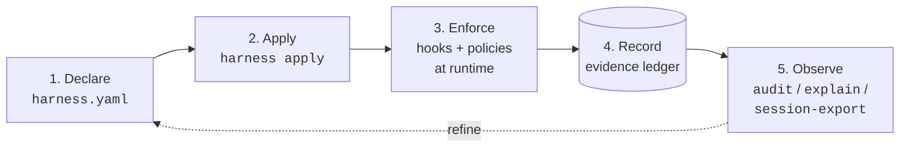

# harness

**Declarative control plane for agent harnesses.**

One zod-validated YAML manifest for grounding, tools, memory, hooks,
policies, and workflows, plus a CLI that describes, validates, diffs,
applies, audits, and *enforces*.

> Most config tools tell you what an agent is configured to use.
> `harness` tells you what an agent is *allowed to do*, under this
> exact context, and why.

`harness` collapses the six-to-eight surfaces a working agent harness
leaks across (`settings.json`, `CLAUDE.md`, memory frontmatter, MCP
registrations, per-project overrides, hook scripts) into a single
source of truth. Today (`v0.8.1`) policies fire end-to-end and ship as
reusable *Policy Packs*: a
`mcp__agent-tasks__pull_requests_merge` call against a session
without a `review:${PR_NUMBER}` ledger entry refuses; an `Edit` /
`apply_patch` against a session without an approved Understanding
Report refuses; `harness explain --last --trace` shows exactly why.
The Understanding Gate ships across both Claude Code and Codex
runtimes via `harness apply --runtime <claude-code|codex>`.

## What harness does



One manifest declares grounding, tools, memory, hooks, policies, and
workflows. `apply` materialises that into the files Claude Code
actually reads. At runtime, hooks and policies enforce the contract
and write decision rows to the evidence ledger. The read-side
surfaces (`audit`, `explain --trace`, `session-export`) replay those
rows so you can see what fired, why, and across which session.
Whatever you learn from observing flows back into the manifest. That
loop is the whole product.

## Pick your audience

- **Operator?** Read [`docs/for-humans.md`](docs/for-humans.md). It
  walks from `npm i -g @lannguyensi/harness` through your first
  `apply`, your first real policy, and the diagnostics cheat sheet.
- **Agent (or onboarding one)?** Read
  [`docs/for-agents.md`](docs/for-agents.md). It defines the
  workflow lifecycle, the policy / ledger sequence, the CLI cheat
  sheet split by side-effect class, and the audit triumvirate
  (`audit` vs `explain --trace` vs `session-export`).

## Install

```bash
npm i -g @lannguyensi/harness
```

The CLI binary is `harness`. Node 20 or newer required.

## Try it in 60 seconds

```bash
git clone https://github.com/LanNguyenSi/harness && cd harness
npm install && npm run build
node dist/cli/main.js dry-run "merge PR 42" \
  --tool mcp__agent-tasks__pull_requests_merge \
  --tool-args '{"prNumber":42}' \
  --config docs/examples/full-manifest.yaml
```

`dry-run` reads the reference manifest, runs the trigger matcher,
substitutes `${PR_NUMBER}=42` through the JSONPath-restricted extract
DSL, and tells you exactly which hooks would fire and which policies
would match, before any ledger I/O.

## Status

- [x] Phase 1, read-only inventory (`describe`, `validate`, `doctor`,
      `list`, `explain`, `diff`), released as
      [`v0.1.0`](CHANGELOG.md#010---2026-04-29).
- [x] Phase 2, managed edits (`init`, `add`, `remove`, `adopt`,
      `export`), released as [`v0.2.0`](CHANGELOG.md#020---2026-04-29).
- [x] Phase 3, declarative truth (`apply`, `diff --since-apply`,
      `harness.lock`), released as
      [`v0.3.0`](CHANGELOG.md#030---2026-04-30).
- [x] Phase 4, policy layer (`policy intercept`, `explain --trace`,
      `audit`, `dry-run`, requires-evaluator + extract DSL +
      grounding-mcp adapter), released as
      [`v0.4.0`](CHANGELOG.md#040---2026-04-30).
- [x] Phase 5, polish + dogfood lessons (`--verbose` policy
      diagnostics, `$CLAUDE_SESSION_ID` env fallback, server-side
      `audit` filter pushdown, `policy_decision` first-class entry
      type, npm distribution as `@lannguyensi/harness`), released as
      [`v0.5.0`](CHANGELOG.md#050---2026-05-01).
- [x] Apply-into-settings cycle, `harness adopt`, `apply --target /
      --merge`, `harness.lock` target tracking, released as
      [`v0.6.0`](CHANGELOG.md#060---2026-05-03).
- [x] Workflows-as-data + full-session audit forensics: additive
      `workflows:` / `review_templates:` / `audit.redact[]` manifest
      blocks, `harness session-export`, `explain --last`, audience-
      specific docs surfaces, released as
      [`v0.7.0`](CHANGELOG.md#070---2026-05-06).
- [x] Phase 6, Understanding Gate Policy Pack: `policy_packs:`
      manifest block, the canonical `understanding-before-execution`
      pack, `harness pack add / remove / list`,
      `harness apply --runtime <claude-code|codex>` with TOML config
      output for Codex, three permission profiles
      (`safe-start` / `implementation-after-approval` /
      `high-risk-grill-me`), a harness-side PreToolUse blocker that
      consults both the evidence-ledger tag and the persisted JSON
      report, `harness approve understanding`,
      `harness doctor --target codex`, and a Codex Stop-equivalent
      that captures Understanding Reports into
      `.understanding-gate/reports/`. Released as
      [`v0.8.0`](CHANGELOG.md#080---2026-05-10).
- [ ] Phase 7, Risk Gate: Action Envelope + Risk Classifier +
      `allow / warn / require_approval / deny` for destructive-action
      prevention.

## Policy Packs (v0.8.1)

A *Policy Pack* is a reusable bundle of instruction template, hooks,
policies, and permission profiles that ships under one name and is
referenced from `harness.yaml` with a single key. The first pack,
`understanding-before-execution`, forces agents to expose and confirm
their task interpretation before any write-capable tool fires.

```yaml
policy_packs:
  - name: understanding-before-execution
    config:
      mode: grill_me                       # fast_confirm | grill_me | strict
      permission_profile: safe-start       # safe-start | implementation-after-approval | high-risk-grill-me
```

Manage packs with `harness pack add / remove / list`. Apply against
either runtime:

```sh
harness apply --runtime claude-code        # default; writes harness.generated/settings.json
harness apply --runtime codex              # writes harness.generated/codex/config.toml
```

Approve a session's Understanding Report via
`harness approve understanding --session <id>` (round-trips both the
evidence-ledger tag and the persisted JSON report). Verify the
adapter wiring with `harness doctor --target codex` (`--json` for
machine-readable). The full reference lives in
[`docs/policy-packs/understanding-before-execution.md`](docs/policy-packs/understanding-before-execution.md);
synthetic-stdin dogfood under
[`dogfood/phase6-6/`](dogfood/phase6-6/run-smoke.sh) exercises the
block / allow / capture / approve round-trip without a real Codex
binary.

## What's next

**Phase 7, Risk Gate.** Today's policy model evaluates a rule per
matching trigger and returns a binary block/allow. Phase 7 makes
harness reason about *the action itself*: an Action Envelope (tool +
raw input + session + runtime context) is enriched by a Context
Resolver (production / staging / dev / unknown), classified by a Risk
Classifier (severity + categories + reversibility), then matched
against policies whose `when:` clauses can reference
`risk.severity_at_least`, `environment.name`, and similar. The
decision space extends to `allow / warn / require_approval / deny`.
Motivating use case: prevent `DROP TABLE users`, `kubectl delete
namespace prod`, `terraform destroy` against an unverified production
target, even if the model would have happily run them.

Phase 7 builds on Phase 4's `policy intercept` runtime backbone and
Phase 6's Policy Pack distribution surface; neither is replaced.

> Bring your favorite agent harness. Add governance.

## Why this exists

A working agent harness today has six to eight configuration
surfaces, each with its own schema and lifecycle: `~/.claude/settings.json`,
`CLAUDE.md` (per repo + root), `~/.claude/projects/*/memory/*.md`
with frontmatter, `~/.claude/keybindings.json`, MCP server
registrations in `~/.claude.json`, skill directories, per-project
overrides, and external CLIs that behave differently per project.

There is no single place that answers *"what can this agent do right
now, and why is that configured that way?"*. Drift between sessions
is invisible until it breaks something. Humans editing one surface
do not know which other surfaces they need to touch. A fresh agent
instance has no way to audit its own setup.

Our entry point into this problem: on 2026-04-23, an
`agent-grounding` checkout that was 16 commits behind origin led two
tasks to be incorrectly called "stale". The check that would have
caught it already exists,
[`agent-preflight`](https://github.com/LanNguyenSi/agent-preflight)
runs `git fetch` + `git status` (alongside lint, typecheck, test,
audit) and emits a structured `ready` + confidence-score result. The
missing piece was not the check itself, it was the deterministic
*trigger*: a `SessionStart` hook that invokes `preflight run` and a
policy that gates further work on the result. Building that wiring
needs an agreed-upon place for harness config to live first. That
conversation is the origin of this repo.

## Related

- [`agent-grounding`](https://github.com/LanNguyenSi/agent-grounding):
  grounding primitives (evidence-ledger, claim-gate,
  review-claim-gate); `grounding-mcp` is the canonical client surface
  harness queries through `queryLedgerByTag`.
- [`agent-memory`](https://github.com/LanNguyenSi/agent-memory):
  memory surfaces the control plane inventories.
- [`agent-tasks`](https://github.com/LanNguyenSi/agent-tasks): the
  MCP-registered task platform whose registration + health appear in
  `harness describe`.
- [`agent-preflight`](https://github.com/LanNguyenSi/agent-preflight):
  local preflight validator; the canonical implementation of
  preflight-hook content harness wires.
- [`codebase-oracle`](https://github.com/LanNguyenSi/codebase-oracle):
  one of the MCP surfaces being registered.
- [`agent-dx`](https://github.com/LanNguyenSi/agent-dx): ships
  `git-batch-cli`, a day-to-day tool whose inventory appears in
  `harness describe`.

## License

MIT, see [LICENSE](LICENSE).
