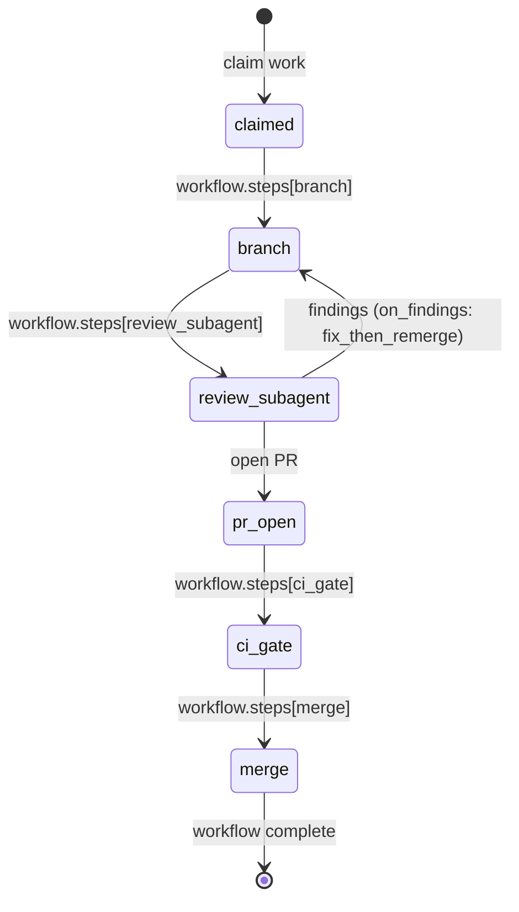
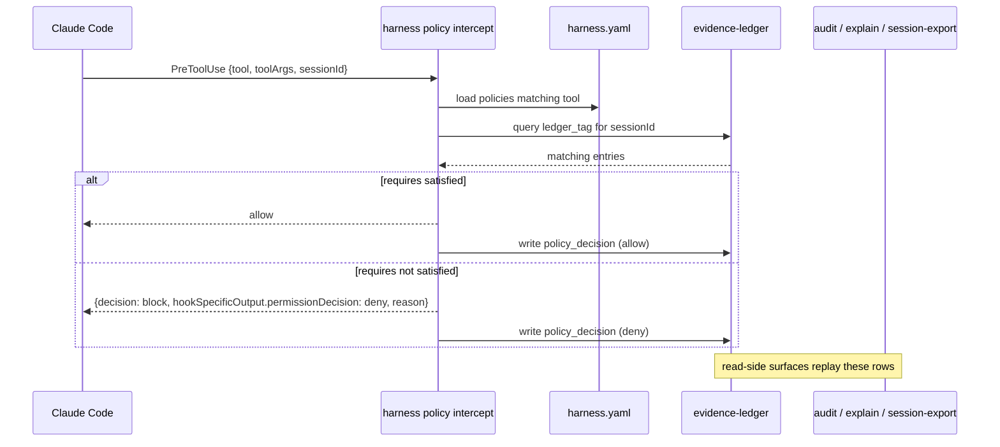

# harness, for agents

You are an agent (or the contributor onboarding one). harness is the
thing your hooks are configured by. You do not speak to it directly at
runtime; you read its outputs (`audit`, `explain --trace`,
`session-export`) and you emit ledger entries that policies require.
This doc is the integration contract.

For the operator's view of the same system (install, `apply`, drift
handling), see [`for-humans.md`](for-humans.md).

## Orientation in three sentences

1. The manifest declares hooks, policies, and workflows. `harness
   apply` materialises them into `settings.json`. Claude Code loads
   that and fires hooks at the events the manifest listed.
2. When a policy hook fires, `harness intercept` evaluates the policy
   against the evidence ledger. If the required `ledger_tag` has no
   matching entry, the call is denied and the deny is recorded as a
   `policy_decision` row.
3. Your job, as the agent, is to log the evidence the policies
   require: a `review:${PR_NUMBER}` entry before a merge, a
   `dogfood:${SESSION_ID}` entry before a release, and so on. Do that
   via `mcp__agent-grounding__ledger_add` (or whatever ledger surface
   the host repo provides).

## Workflow lifecycle

When the manifest declares a `workflows:` block (PR #66), the
expected lifecycle for any unit of work you pick up walks the four
step kinds the schema defines: `branch`, `review_subagent`,
`ci_gate`, `merge`.



Each named state corresponds to a step kind in the manifest.
`branch` codifies the one-branch-per-task rule. `review_subagent`
with `spawn: required` forces a checklist-driven review before the
PR opens; if findings come back, the on_findings policy
(`fix_then_remerge` by default) sends you back to the branch step
to fix and re-review. `merge.gate: solo` (in soloMode projects) or
`agent_tasks_label` (in dual-review projects) decides who is
allowed to press the green button.

If you skip the `review_subagent` step you are violating the
workflow contract. The schema cannot enforce that today (runtime
enforcement is a follow-up to PR #66), but the `review_templates:`
block tells you exactly what checklist the reviewer is supposed to
work through. Use it.

### If you use agent-tasks MCP

harness does not depend on agent-tasks. The lifecycle above is
generic; bind it to whatever task system you actually use. As one
concrete example, an agent with `mcp__agent-tasks__*` connected
maps the harness states to MCP verbs roughly like this: `claim
work` is `task_start` (transitions the task to `in_progress`);
`open PR` is `pull_requests_create`; `workflow complete` is
`pull_requests_merge` (which today lands the task on `done` via
the REST endpoint regardless of project mode). Other task systems
(linear, jira, github projects) fit the same lifecycle by binding
their own claim / open-PR / close-task verbs to the same harness
steps.

## Policy / ledger sequence

A `PreToolUse` policy gate looks like this end to end:



The runtime path is `harness policy intercept` (a subcommand under
`policy`). The read-side surfaces (`audit`, `explain --trace`,
`session-export`) never write; they replay `policy_decision` rows
the runtime already recorded.

## Agent-facing block messages (`ux:` block)

When a policy denies your tool call, the runtime can render the
deny envelope in one of two shapes. Which one you see is decided
per-policy by whether the manifest declares a `ux:` block on that
policy (or on the pack `config:` for pack-shipped blockers).

**Legacy shape** (no `ux:` declared): the `permissionDecisionReason`
text leaks engine vocabulary, e.g.

```
review-before-merge: no matching ledger entry for tag `review:42`
```

**Agent-facing shape** (`ux:` declared, default for every built-in
block-enforcement policy and pack as of v0.17.x; the warn-only
`two-reviewers-required` policy omits it because the agent never
sees a warn): three sections, verbatim from
`formatAgentFacingMessage` in `src/runtime/agent-facing.ts`:

```
You cannot investigate this repository yet.

Required:
- verified repository preflight

Run:
  harness preflight
```

The three sections always appear in the same order, with `- ` prefixes
under `Required:` and a two-space indent under `Run:`. Read them as
state (what is blocked), requirement (in plain words, never "ledger
entry for tag X"), remedy (the exact command to type).

### What changes between the two readers

The agent-facing shape replaces only the agent surface. The
engine-internal model (session IDs, ledger entries, `recordHint`,
`matchedCount`, `ledgerTag`, policy DAGs) is unchanged and still
feeds the audit ledger, so `harness audit`, `harness explain
--trace`, and `harness session-export` keep their full trace. The
operator-facing BLOCK reason (which names the session id, the
missing tag, and which approval sources failed) stays on stderr.

```
┌──────────────────────────────┐    ┌──────────────────────────────┐
│ Agent (stdout / hookOutput)  │    │ Operator (stderr / audit)    │
├──────────────────────────────┤    ├──────────────────────────────┤
│ You cannot push branch X.    │    │ preflight-before-push: no    │
│                              │    │ matching ledger entry for    │
│ Required:                    │    │ tag `preflight:feat/foo`     │
│ - a fresh preflight for X    │    │ within 10m (matchedCount: 0) │
│                              │    │ session: <uuid>              │
│ Run:                         │    │                              │
│   harness preflight          │    │ → policy_decision row written │
└──────────────────────────────┘    └──────────────────────────────┘
```

### `${VAR}` substitution context

`cannot`, `required[]`, and `run[]` are templates. `${VAR}`
references resolve against the same `extract.values` map the
policy's `ledger_tag` was substituted with, plus the builtins,
which are available even when the policy declares no `trigger.extract`:

| Variable | Source |
|---|---|
| `${SESSION_ID}` | Claude Code session id |
| `${REPO}` | basename of `cwd` |
| `${BRANCH}` | resolved git HEAD (or `(detached)`) |
| `${TOOL_NAME}` | the tool the agent invoked |
| `${CWD}` | the agent's working directory |
| `${PR_NUMBER}`, `${TASK_ID}`, ... | per-policy `trigger.extract` keys |

Pack-shipped blockers add their own context. `branch-protection`
substitutes `${BRANCH}` from the resolved git context;
`understanding-before-execution` reads `${SESSION_ID}` from the
hook payload. Unresolved references are left literal so the agent
can still read what was expected.

### Producers are suppressed when `ux:` is set

A policy with both `producers:` and `ux:` shows only the `ux:`
shape on the agent surface. The `run:` list is the canonical
remedy; rendering both would give you two different command
suggestions for the same block. `producers:` still feeds
`harness explain --trace` for operator-side diagnostics.

### When you encounter a block

1. Read the three sections in order: state, requirement, remedy.
2. Run the `Run:` command. If it is a bare `harness ...` invocation,
   the Bash gate accepts it; if it is an `mcp__agent-grounding__ledger_add`
   recipe, write it via the MCP tool (the ungated recovery path when
   Bash is locked down).
3. Retry the original tool call. The same call goes straight through
   once the requirement is satisfied, no restart needed.
4. If you cannot satisfy the requirement, ask the operator. The
   stderr diagnostic gives them the engine-vocabulary detail to
   debug from.

## CLI cheat sheet

Everything in **read-only** is safe to call without side effects:
the manifest is parsed, files are read, ledger queries are read-only,
nothing is rendered or written. Use them freely from agent tooling.

**Mutating** verbs change files on disk. Reserve them for explicit
operator-driven flows.

| Verb | Side effect | Notes |
|------|------|------|
| `describe` | read-only | effective merged manifest as YAML or JSON. `--pillar` filters. |
| `list <category>` | read-only | flat row-per-entry table. categories: mcp, cli, skills, memories, hooks, policies, workflows. |
| `validate` | read-only | schema + asset checks. `--check-lock` adds drift detection. |
| `doctor` | read-only | health summary. `--shallow` skips MCP probes. |
| `diff` | read-only | manifest vs git ref or `--since-apply` last-rendered output. |
| `audit` | read-only | replays recent `policy_decision` rows from the ledger. |
| `explain [policy]` | read-only | per-policy trace. `--last` resolves the most recent decision in this session. |
| `session-export <sid>` | read-only | joins the on-disk transcript JSONL with ledger rows for the session, redacts secrets, emits json/jsonl. |
| `dry-run <prompt>` | read-only | predicts which hooks fire and which policies match for a prompt + tool, without ledger I/O. |
| `apply` | mutating | renders manifest to `harness.generated/` (or `--target`), updates `harness.lock`. |
| `add` | mutating | mutates `harness.yaml` in place to add an mcp / cli / skill / hook entry. |
| `remove` | mutating | removes an entry by type + name from the manifest. |
| `init --template <name>` | mutating | scaffolds a manifest non-interactively. Templates: `minimal`, `solo`, `team`, `full`. |
| `init --interactive` | mutating | operator-facing wizard (`@inquirer/prompts`). Detects env, picks a profile, writes the manifest. Not for agent driver scripts. |
| `init --probe` | read-only | prints a JSON snapshot of detected runtimes + MCPs + manifest; no writes. |
| `adopt` | mutating | reverse engineers a manifest from an existing settings.json. |
| `export` | mutating-ish | emits a manifest snapshot to a chosen path. |
| `pack add / remove / list` | mutating (add/remove), read-only (list) | manages `policy_packs:` entries in the manifest. Today's canonical pack: `understanding-before-execution`. |
| `approve understanding --session <id>` | mutating | operator action that approves a captured Understanding Report (round-trips evidence-ledger tag + persisted JSON). Required before write-capable tools fire under the understanding-before-execution pack. |
| `doctor --target codex` | read-only | verifies Codex adapter wiring after `apply --runtime codex`. `--json` for machine-readable output. |
| `policy intercept` | runtime hook | called by Claude Code via `settings.json`, not directly by agents. |

## The audit triumvirate

Three CLI surfaces read the ledger. Pick the right one for the
question you are asking.

- `harness audit --since 1h [--policy <name>] [--outcome deny]`. "What
  decisions fired recently?" Returns one row per `policy_decision`,
  sorted chronologically. Good for "is this gate even firing?" or
  "show me everything that has been denied today".
- `harness explain --last` (or `harness explain <policy> --trace`).
  "Why did this exact decision land where it did?" Walks the requires
  evaluator: which entries were considered, which `within:` window
  applied, what extracted variables resolved to. Good for "I just got
  a deny and I do not understand which entry was missing".
- `harness session-export <sessionId>`. "Reconstruct the entire
  session as one chronological audit artifact." Joins the on-disk
  Claude Code transcript JSONL (prompts, tool_use blocks, tool_result
  blocks, assistant text) with ledger rows for the same session.
  Default-on regex redaction strips obvious secrets; `audit.redact[]`
  in the manifest extends the denylist. Good for "show me what
  actually happened in session X".

If a teammate asks "what did the agent do in this session", reach
for `session-export`. If they ask "why did this gate fire", reach for
`explain --trace`. If they ask "is the gate firing at all today",
reach for `audit`.

## Things you must NOT do as an agent

- Do not skip the `review_subagent` step in the workflow. The
  rigorous-review checklist exists because batch-approval drift has
  cost real merges in the past.
- Do not bypass hook scripts with `--no-verify` or by editing the
  generated `settings.json` directly. If a hook is failing, the fix
  is to fix the hook (or the policy), not to silence it.
- Do not swallow stderr from `harness intercept`. The `--verbose`
  diagnostic block is the canonical "why did this fire" output.
- Do not force-push to `master`, even when you "are sure". The
  workflow always cuts a fresh branch off the latest master.
- Do not hand-edit `harness.generated/`. The next `apply` clobbers
  it. Edit `harness.yaml` instead.
- Do not commit secrets in tool_use input. The default
  `audit.redact[]` regex catches the obvious patterns at
  `session-export` time, but the safer move is to never put a token
  in a tool argument in the first place.

## Where to read next

- [`docs/for-humans.md`](for-humans.md): operator-side guide. Useful
  when you need to ask the operator for a manifest change.
- [`docs/ARCHITECTURE.md`](ARCHITECTURE.md): authoritative YAML
  shape, CLI surface, drift handling, `requires` schema, hook
  contract.
- [`docs/examples/full-manifest.yaml`](examples/full-manifest.yaml):
  a manifest exercising every field, including `workflows:`,
  `review_templates:`, and `audit.redact[]`.
- [`CHANGELOG.md`](../CHANGELOG.md): what shipped when, with the PR
  number that introduced each surface.
