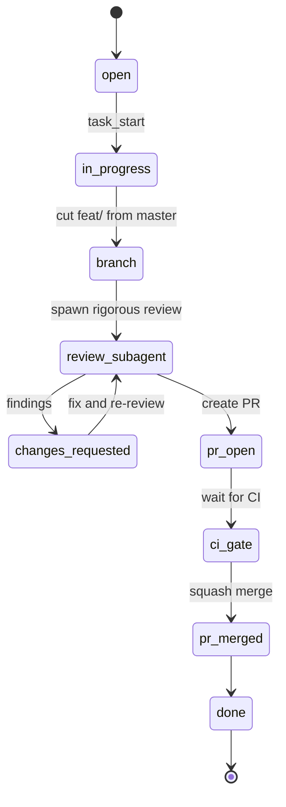
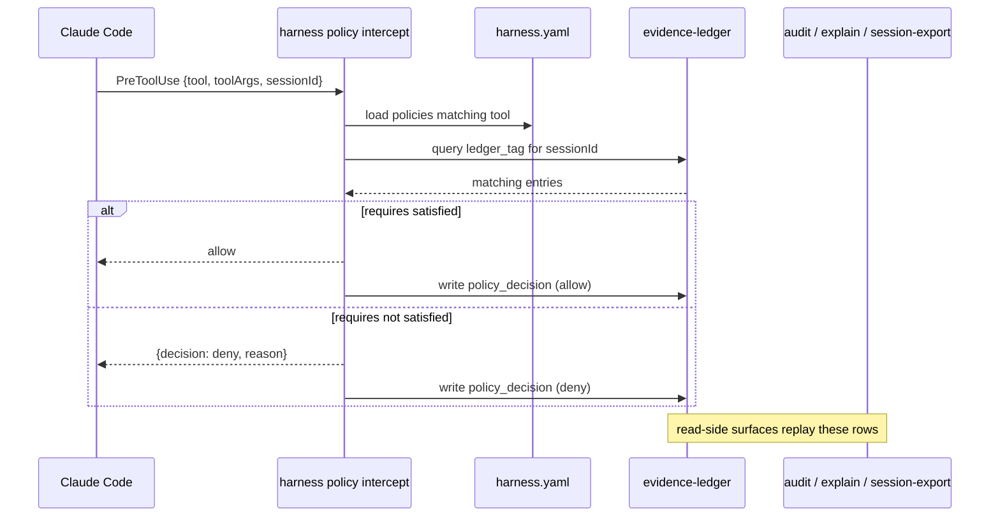

# harness, for agents

You are an agent (or the contributor onboarding one). harness is the
thing your hooks are configured by. You do not speak to it directly at
runtime; you read its outputs (`audit`, `explain --trace`,
`session-export`) and you emit ledger entries that policies require.
This doc is the integration contract.

For the operator's view of the same system (install, `apply`, drift
handling), see [`for-humans.md`](for-humans.md).

## Orientation in three sentences

1. The manifest declares hooks, policies, and workflows. `harness
   apply` materialises them into `settings.json`. Claude Code loads
   that and fires hooks at the events the manifest listed.
2. When a policy hook fires, `harness intercept` evaluates the policy
   against the evidence ledger. If the required `ledger_tag` has no
   matching entry, the call is denied and the deny is recorded as a
   `policy_decision` row.
3. Your job, as the agent, is to log the evidence the policies
   require: a `review:${PR_NUMBER}` entry before a merge, a
   `dogfood:${SESSION_ID}` entry before a release, and so on. Do that
   via `mcp__agent-grounding__ledger_add` (or whatever ledger surface
   the host repo provides).

## Workflow lifecycle

When the manifest declares a `workflows:` block (PR #66), the
expected lifecycle for any task you pick up is:

Each transition is named in the manifest. `branch` codifies the
one-branch-per-task rule. `review_subagent` with `spawn: required`
forces a checklist-driven review before the PR opens. `merge.gate:
solo` (in soloMode projects) or `agent_tasks_label` (in dual-review
projects) decides who is allowed to press the green button.

If you skip the `review_subagent` step you are violating the
workflow contract. The schema cannot enforce that today (runtime
enforcement is a follow-up to PR #66), but the `review_templates:`
block tells you exactly what checklist the reviewer is supposed to
work through. Use it.

## Policy / ledger sequence

A `PreToolUse` policy gate looks like this end to end:

The runtime path is `harness policy intercept` (a subcommand under
`policy`). The read-side surfaces (`audit`, `explain --trace`,
`session-export`) never write; they replay `policy_decision` rows
the runtime already recorded.

## CLI cheat sheet

Everything in **read-only** is safe to call without side effects:
the manifest is parsed, files are read, ledger queries are read-only,
nothing is rendered or written. Use them freely from agent tooling.

**Mutating** verbs change files on disk. Reserve them for explicit
operator-driven flows.

| Verb | Side effect | Notes |
|------|------|------|
| `describe` | read-only | effective merged manifest as YAML or JSON. `--pillar` filters. |
| `list <category>` | read-only | flat row-per-entry table. categories: mcp, cli, skills, memories, hooks, policies, workflows. |
| `validate` | read-only | schema + asset checks. `--check-lock` adds drift detection. |
| `doctor` | read-only | health summary. `--shallow` skips MCP probes. |
| `diff` | read-only | manifest vs git ref or `--since-apply` last-rendered output. |
| `audit` | read-only | replays recent `policy_decision` rows from the ledger. |
| `explain [policy]` | read-only | per-policy trace. `--last` resolves the most recent decision in this session. |
| `session-export <sid>` | read-only | joins the on-disk transcript JSONL with ledger rows for the session, redacts secrets, emits json/jsonl. |
| `dry-run <prompt>` | read-only | predicts which hooks fire and which policies match for a prompt + tool, without ledger I/O. |
| `apply` | mutating | renders manifest to `harness.generated/` (or `--target`), updates `harness.lock`. |
| `add` | mutating | mutates `harness.yaml` in place to add an mcp / cli / skill / hook entry. |
| `remove` | mutating | removes an entry by type + name from the manifest. |
| `init` | mutating | scaffolds a new manifest from a template. |
| `adopt` | mutating | reverse engineers a manifest from an existing settings.json. |
| `export` | mutating-ish | emits a manifest snapshot to a chosen path. |
| `policy intercept` | runtime hook | called by Claude Code via `settings.json`, not directly by agents. |

## The audit triumvirate

Three CLI surfaces read the ledger. Pick the right one for the
question you are asking.

- `harness audit --since 1h [--policy <name>] [--outcome deny]`. "What
  decisions fired recently?" Returns one row per `policy_decision`,
  sorted chronologically. Good for "is this gate even firing?" or
  "show me everything that has been denied today".
- `harness explain --last` (or `harness explain <policy> --trace`).
  "Why did this exact decision land where it did?" Walks the requires
  evaluator: which entries were considered, which `within:` window
  applied, what extracted variables resolved to. Good for "I just got
  a deny and I do not understand which entry was missing".
- `harness session-export <sessionId>`. "Reconstruct the entire
  session as one chronological audit artifact." Joins the on-disk
  Claude Code transcript JSONL (prompts, tool_use blocks, tool_result
  blocks, assistant text) with ledger rows for the same session.
  Default-on regex redaction strips obvious secrets; `audit.redact[]`
  in the manifest extends the denylist. Good for "show me what
  actually happened in session X".

If a teammate asks "what did the agent do in this session", reach
for `session-export`. If they ask "why did this gate fire", reach for
`explain --trace`. If they ask "is the gate firing at all today",
reach for `audit`.

## Things you must NOT do as an agent

- Do not skip the `review_subagent` step in the workflow. The
  rigorous-review checklist exists because batch-approval drift has
  cost real merges in the past.
- Do not bypass hook scripts with `--no-verify` or by editing the
  generated `settings.json` directly. If a hook is failing, the fix
  is to fix the hook (or the policy), not to silence it.
- Do not swallow stderr from `harness intercept`. The `--verbose`
  diagnostic block is the canonical "why did this fire" output.
- Do not force-push to `master`, even when you "are sure". The
  workflow always cuts a fresh branch off the latest master.
- Do not hand-edit `harness.generated/`. The next `apply` clobbers
  it. Edit `harness.yaml` instead.
- Do not commit secrets in tool_use input. The default
  `audit.redact[]` regex catches the obvious patterns at
  `session-export` time, but the safer move is to never put a token
  in a tool argument in the first place.

## Where to read next

- [`docs/for-humans.md`](for-humans.md): operator-side guide. Useful
  when you need to ask the operator for a manifest change.
- [`docs/ARCHITECTURE.md`](ARCHITECTURE.md): authoritative YAML
  shape, CLI surface, drift handling, `requires` schema, hook
  contract.
- [`docs/examples/full-manifest.yaml`](examples/full-manifest.yaml):
  a manifest exercising every field, including `workflows:`,
  `review_templates:`, and `audit.redact[]`.
- [`CHANGELOG.md`](../CHANGELOG.md): what shipped when, with the PR
  number that introduced each surface.
