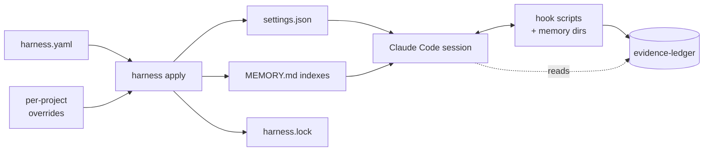

# harness, for humans

You are an operator: someone who installs harness, writes the YAML
manifest, runs `apply`, and watches the agent it configures behave the
way you said it should. This doc is the path from "fresh checkout" to
"my Claude Code session is gated by ledger evidence I trust".

For the agent's view of the same system (which CLI verbs are safe to
call, what the policy contract looks like, how to read the audit
triumvirate), jump to [`for-agents.md`](for-agents.md).

## 30-second pitch

`harness` is the declarative control plane for an agent harness. One
zod-validated `harness.yaml` describes grounding, tools, memory, hooks,
policies, and workflows. `harness apply` materialises that manifest
into the files Claude Code actually reads (`settings.json`, memory
indexes, sibling assets) and records a sha256 of every output in
`harness.lock`. You diff the manifest, not seven hand-edited files.

## Mental model



The manifest is the source of truth. Everything else is rendered. The
diagnostics (`validate`, `doctor`, `diff --since-apply`) tell you when
the rendered files have drifted from what the manifest currently says.

## Install

```bash
npm i -g @lannguyensi/harness
```

The CLI binary is `harness`. Node 20 or newer required.

## First five minutes

1. Bootstrap a starter manifest into `/tmp/harness-demo/`:

   ```bash
   harness init --template starter --config /tmp/harness-demo/harness.yaml
   ```

2. See what is in it:

   ```bash
   harness describe --config /tmp/harness-demo/harness.yaml --pillar tools
   harness list mcp --config /tmp/harness-demo/harness.yaml
   ```

3. Lint it:

   ```bash
   harness validate --config /tmp/harness-demo/harness.yaml
   harness doctor   --config /tmp/harness-demo/harness.yaml --shallow
   ```

4. Render the configured surfaces:

   ```bash
   harness apply --config /tmp/harness-demo/harness.yaml
   ```

   Output lands in `/tmp/harness-demo/harness.generated/`. By default
   nothing escapes that directory.

## Wire into Claude Code

To make Claude Code actually use the rendered settings, point `apply`
at a real settings discovery path with `--target`:

```bash
# Project scope: write straight to .claude/settings.local.json (created if missing).
harness apply --target .claude/settings.local.json

# User scope: merge harness-owned keys into your existing ~/.claude/settings.json,
# preserving env, permissions, enabledPlugins, and any other top-level keys.
harness apply --target ~/.claude/settings.json --merge
```

`--merge` does a 3-way merge: harness-owned top-level keys (today
`hooks` and `mcpServers`) get replaced wholesale; everything else in
the existing target file is preserved verbatim. Re-applying is
idempotent: running twice produces the same target, and the second run
reports `no changes`.

If the target exists and you pass neither `--merge` nor `--force`,
`apply` refuses with a clear hint instead of clobbering. `--force`
overwrites with the generated content as-is (no merge).

`harness.lock` records the target path plus a sha256 of the merged
output, so `harness validate --check-lock` flags out-of-band edits.

## First hour: a real policy

Suppose you want this contract: "before merging a PR, the session must
have logged a `review:${PR_NUMBER}` evidence-ledger entry." Sketch it
into `harness.yaml`:

```yaml
hooks:
  - name: require-review-evidence
    event: PreToolUse
    blocking: true
    command: ~/.claude/hooks/require-review-evidence.sh

policies:
  - name: review-before-merge
    description: Block PR merge without a review ledger entry.
    trigger:
      event: PreToolUse
      match: "mcp__agent-tasks__pull_requests_merge"
      extract:
        PR_NUMBER: "toolArgs.prNumber"
    requires:
      ledger_tag: "review:${PR_NUMBER}"
    hook: require-review-evidence
    enforcement: block
```

Then dry-run it without any ledger I/O:

```bash
harness dry-run "merge PR 42" \
  --tool mcp__agent-tasks__pull_requests_merge \
  --tool-args '{"prNumber":42}' \
  --config harness.yaml
```

The output enumerates which hooks would fire, which policies would
match, and (importantly) which policies would NOT match plus why. Once
you are happy, `harness apply --target ~/.claude/settings.json
--merge`, restart Claude Code, and the gate is live.

When the policy actually denies a tool call, the runtime emits Claude
Code's deny shape on stdout. For PreToolUse hooks (the most common case)
the payload carries both the legacy `decision: "block"` field and the
Claude Code 2.1+ `hookSpecificOutput` envelope:

```json
{"decision":"block","reason":"review-before-merge: no matching ledger entry for tag `review:42`","hookSpecificOutput":{"hookEventName":"PreToolUse","permissionDecision":"deny","permissionDecisionReason":"review-before-merge: no matching ledger entry for tag `review:42`"}}
```

For non-PreToolUse hooks (UserPromptSubmit, PostToolUse, Stop, ...) only
the top-level `decision`/`reason` pair is emitted, since
`permissionDecision` is PreToolUse-only per Anthropic's hook protocol.

After the entry is recorded, the same call is allowed. `harness audit
--since 1h --policy review-before-merge` replays the decision row.
`harness explain review-before-merge --trace` walks the requires
evaluator step by step so you can see what matched.

## What you should NOT do

- Do not hand-edit anything under `harness.generated/`. It gets
  clobbered on the next `apply`. Edit the manifest instead.
- Do not bypass `harness.lock` drift warnings. They are the only
  signal that something other than `apply` touched a managed file.
- Do not mix `apply --target ...` with manual `cp harness.generated/
  ~/.claude/settings.json`. Pick one path.
- Do not skip `validate` before committing. The schema catches
  misnamed hooks, undeclared template references, and bad duration
  strings before they ship.

## Diagnostics cheat-sheet

| You want to know | Run |
|------|------|
| Effective merged manifest, with overrides applied | `harness describe` |
| One pillar only (tools, hooks, policies, workflows, ...) | `harness describe --pillar <name>` |
| Flat row-per-entry view of one category | `harness list <category>` |
| Schema + asset issues (warnings + errors) | `harness validate` |
| Schema issues, plus drift since last `apply` | `harness validate --check-lock` |
| Health summary across all pillars (MCP probes, hook executability, memory dir state) | `harness doctor` |
| What changed since I last ran `apply` | `harness diff --since-apply` |
| Replay recent policy decisions | `harness audit --since 24h` |
| Why did this exact policy fire just now? | `harness explain --last` |
| Full chronological session export (transcript + ledger, redacted) | `harness session-export <sessionId>` |

## Where to read next

- [`docs/for-agents.md`](for-agents.md): how agents interact with the
  same harness instance, the audit triumvirate, the merge-gate
  contract.
- [`docs/ARCHITECTURE.md`](ARCHITECTURE.md): YAML shape, CLI surface,
  drift handling, `requires` schema.
- [`docs/ROADMAP.md`](ROADMAP.md): phases 1 through 7 with acceptance
  criteria.
- [`docs/VISION.md`](VISION.md): long-form positioning.
- [`docs/examples/full-manifest.yaml`](examples/full-manifest.yaml): a
  manifest that exercises every field.
- [`CHANGELOG.md`](../CHANGELOG.md): what shipped when.
