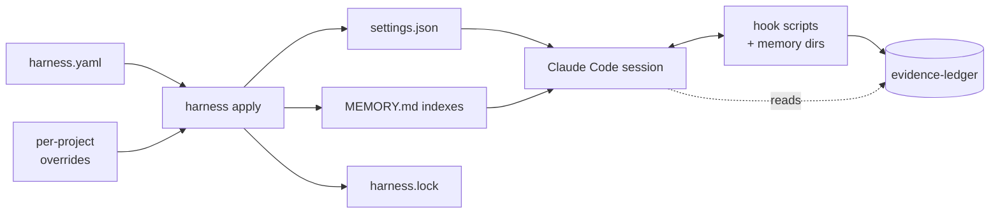

# harness, for humans

You are an operator: someone who installs harness, writes the YAML
manifest, runs `apply`, and watches the agent it configures behave the
way you said it should. This doc is the path from "fresh checkout" to
"my Claude Code session is gated by ledger evidence I trust".

For the agent's view of the same system (which CLI verbs are safe to
call, what the policy contract looks like, how to read the audit
triumvirate), jump to [`for-agents.md`](for-agents.md).

## 30-second pitch

`harness` is the declarative control plane for an agent harness. One
zod-validated `harness.yaml` describes grounding, tools, memory, hooks,
policies, and workflows. `harness apply` materialises that manifest
into the files Claude Code actually reads (`settings.json`, memory
indexes, sibling assets) and records a sha256 of every output in
`harness.lock`. You diff the manifest, not seven hand-edited files.

## Mental model



The manifest is the source of truth. Everything else is rendered. The
diagnostics (`validate`, `doctor`, `diff --since-apply`) tell you when
the rendered files have drifted from what the manifest currently says.

## Install

```bash
npm i -g @lannguyensi/harness
```

The CLI binary is `harness`. Node 20 or newer required.

## First-time setup (recommended)

If this is your first install on this machine, run the guided wizard:

```bash
harness init --interactive
```

It probes your environment (existing `~/.claude/` and `~/.codex/`, MCP
servers wired in `settings.json`, harness binary version), asks you to
pick a profile (`solo` / `team` / `full` / `custom`; `team` and `full` assume an agent-tasks account, `solo` is standalone), and writes a
validate-clean starting `harness.yaml` to `~/.harness/harness.yaml`
(legacy `~/.claude/harness.yaml` only when a pre-`v0.24.0` install is
already there).
Ctrl-C at any prompt aborts with no partial write. The wizard prints
the suggested `harness apply --runtime claude-code` follow-up but does
not run it, so you can review the manifest first. Full walkthrough and
limitations in [`init-interactive.md`](init-interactive.md).

If you prefer a non-interactive bootstrap (CI, fresh-VM provisioning),
the next section walks the manual template path.

## First five minutes (manual template path)

1. Bootstrap a starter manifest into `/tmp/harness-demo/`:

   ```bash
   harness init --template solo --config /tmp/harness-demo/harness.yaml
   ```

   Valid templates: `minimal` (header only), `solo` (memory-router +
   understanding-before-execution pack), `team` (solo + agent-tasks +
   review-before-merge), `full` (everything from the reference
   manifest).

2. See what is in it:

   ```bash
   harness describe --config /tmp/harness-demo/harness.yaml --pillar tools
   harness list mcp --config /tmp/harness-demo/harness.yaml
   ```

3. Lint it:

   ```bash
   harness validate --config /tmp/harness-demo/harness.yaml
   harness doctor   --config /tmp/harness-demo/harness.yaml --shallow
   ```

4. Render the configured surfaces:

   ```bash
   harness apply --config /tmp/harness-demo/harness.yaml
   ```

   Output lands in `/tmp/harness-demo/harness.generated/`. By default
   nothing escapes that directory.

## Wire into Claude Code

To make Claude Code actually use the rendered settings, point `apply`
at a real settings discovery path with `--target`:

```bash
# Project scope: write straight to .claude/settings.local.json (created if missing).
harness apply --target .claude/settings.local.json

# User scope: merge harness-owned keys into your existing ~/.claude/settings.json,
# preserving env, permissions, enabledPlugins, and any other top-level keys.
harness apply --target ~/.claude/settings.json --merge
```

`--merge` does a 3-way merge: harness-owned top-level keys (today
`hooks` and `mcpServers`) come from the generated output; everything
else in the existing target file is preserved verbatim. Within
`mcpServers` the merge is per server name: every name the manifest
declares is taken from the generated output; a server you hand-added
directly to the target file survives (the apply summary names it as
`kept ... operator-added`); and a server harness wrote on a previous
apply that the manifest no longer emits (deleted, or `enabled: false`)
is dropped from the target too (`dropped ... manifest-removed`), so
disabling a server in the manifest stays effective. Provenance comes
from `.last-apply`; on the very first merge (no prior apply recorded)
unknown names are conservatively preserved. `hooks` has no stable
per-entry identity in the settings shape, so it stays
wholesale-replaced — hand-added hooks belong in the manifest
(`harness adopt` pulls them in). Re-applying is idempotent: running
twice produces the same target, and the second run reports
`no changes`.

If the target exists and you pass neither `--merge` nor `--force`,
`apply` refuses with a clear hint instead of clobbering. `--force`
overwrites with the generated content as-is (no merge).

`harness.lock` records the target path plus a sha256 of the merged
output, so `harness validate --check-lock` flags out-of-band edits.

## First hour: a real policy

Suppose you want this contract: "before merging a PR, the session must
have logged a `review:${PR_NUMBER}` evidence-ledger entry." Sketch it
into `harness.yaml`:

```yaml
hooks:
  - name: require-review-evidence
    event: PreToolUse
    blocking: true
    command: ~/.claude/hooks/require-review-evidence.sh

policies:
  - name: review-before-merge
    description: Block PR merge without a review ledger entry.
    trigger:
      event: PreToolUse
      match: "mcp__agent-tasks__pull_requests_merge"
      extract:
        PR_NUMBER: "toolArgs.prNumber"
    requires:
      ledger_tag: "review:${PR_NUMBER}"
    hook: require-review-evidence
    enforcement: block
```

Then dry-run it without any ledger I/O:

```bash
harness dry-run "merge PR 42" \
  --tool mcp__agent-tasks__pull_requests_merge \
  --tool-args '{"prNumber":42}' \
  --config harness.yaml
```

The output enumerates which hooks would fire, which policies would
match, and (importantly) which policies would NOT match plus why. Once
you are happy, `harness apply --target ~/.claude/settings.json
--merge`, restart Claude Code, and the gate is live.

When the policy actually denies a tool call, the runtime emits Claude
Code's deny shape on stdout. For PreToolUse hooks (the most common case)
the payload carries both the legacy `decision: "block"` field and the
Claude Code 2.1+ `hookSpecificOutput` envelope:

```json
{"decision":"block","reason":"review-before-merge: no matching ledger entry for tag `review:42`","hookSpecificOutput":{"hookEventName":"PreToolUse","permissionDecision":"deny","permissionDecisionReason":"review-before-merge: no matching ledger entry for tag `review:42`"}}
```

For non-PreToolUse hooks (UserPromptSubmit, PostToolUse, Stop, ...) only
the top-level `decision`/`reason` pair is emitted, since
`permissionDecision` is PreToolUse-only per Anthropic's hook protocol.

### Splitting the agent surface from the audit surface (`ux:`)

Since v0.17.0, every policy can declare a `ux:` block that replaces
the agent-facing `permissionDecisionReason` with a plain-language
three-section message. The engine-vocabulary `reason` field (above)
stays in the audit ledger and on stderr; only the agent surface
changes.

```yaml
policies:
  - name: review-before-merge
    # ... trigger / requires / hook / enforcement as before
    ux:
      cannot: "You cannot merge PR #${PR_NUMBER} yet."
      required:
        - "a recorded review of PR #${PR_NUMBER}"
      run:
        - 'mcp__agent-grounding__ledger_add { sessionId: "${SESSION_ID}", type: "fact", content: "review:${PR_NUMBER} — <verdict>" }'
```

What lands on each surface:

| Surface | Without `ux:` | With `ux:` |
|---|---|---|
| `permissionDecisionReason` (agent stdout) | `review-before-merge: no matching ledger entry for tag review:42` | `You cannot merge PR #42 yet.\n\nRequired:\n- a recorded review of PR #42\n\nRun:\n  mcp__agent-grounding__ledger_add ...` |
| `policy_decision` row (audit ledger) | engine-vocabulary reason | engine-vocabulary reason (unchanged) |
| `harness audit` / `explain --trace` | engine-vocabulary reason | engine-vocabulary reason (unchanged) |
| stderr diagnostic | engine-vocabulary reason | engine-vocabulary reason (unchanged) |

Every built-in template (`solo` / `team` / `full`) ships `ux:`
defaults on every block-enforcement policy and on the
understanding-before-execution pack (since v0.17.1) and
branch-protection pack (since v0.17.3, after the pack itself
default-shipped in v0.17.2). Manifests without `ux:` keep the legacy envelope verbatim;
no migration needed for 0.16.x installs. The agent-facing reference
is [`for-agents.md`](for-agents.md#agent-facing-block-messages-ux-block).

After the entry is recorded, the same call is allowed. `harness audit
--since 1h --policy review-before-merge` replays the decision row.
`harness explain review-before-merge --trace` walks the requires
evaluator step by step so you can see what matched.

## More policy patterns

Three gates worth copying from
[`docs/examples/full-manifest.yaml`](examples/full-manifest.yaml) once
the first one feels comfortable. The first two were added alongside
this section; `dogfood-before-release` has been in the reference
manifest since v0.4.0 and is included here so the cluster reads as a
coherent set. Each maps to a recurring incident class rather than to a
theoretical risk.

**`review-subagent-before-pr-create`**: gates
`mcp__agent-tasks__pull_requests_create` on a
`review-subagent:${TASK_ID}` ledger entry. Stronger than
`review-before-merge` because it forces the rigorous-review subagent to
have actually run BEFORE the PR opens, not after. The motivating
incident: a batch of 60 README audit tasks once shipped 5 broken PRs
because review was skipped pre-merge; gating PR creation instead of
merge catches the failure earlier. For operators on `gh pr create`
instead of agent-tasks MCP, the full template also ships
`review-subagent-before-pr-create-bash` (and `review-before-merge-bash`)
which match the Bash surface and tag by `${BRANCH}`. See
[`writing-custom-policies.md`](writing-custom-policies.md#same-gate-two-pr-surface-variants-mcp-plus-gh-cli)
for the dual-surface pattern.

**`preflight-before-push`**: gates `Bash` calls running `git push` on
a `preflight:${BRANCH}` ledger entry with `within: 10m`. The match is
not start-anchored, so `cd <repo> && git push` and `git -C <repo> push`
are caught too. Complements the read-side
`preflight-before-investigation` (which gates
`git status / log / diff / branch`). Catches the stale-checkout class
of incident at the last reversible step: an operator who started work
on a 16-commits-behind branch can still notice and pull before the
push lands on the remote.

**`dogfood-before-release`**: gates `npm publish` and `git tag v*` on a
fresh `dogfood:${SESSION_ID}` entry (`within: 24h`). Tags pushed in
bulk only fire one workflow on GitHub, so the smoke test you skip
sometimes ships untested versions silently. The gate makes that
impossible.

All three are written out in the reference manifest. Copy the hook
declaration and the policy declaration together; both sides of the
pair are required for `harness apply` to wire the gate end-to-end.

## What you should NOT do

- Do not hand-edit anything under `harness.generated/`. It gets
  clobbered on the next `apply`. Edit the manifest instead.
- Do not bypass `harness.lock` drift warnings. They are the only
  signal that something other than `apply` touched a managed file.
- Do not mix `apply --target ...` with manual `cp harness.generated/
  ~/.claude/settings.json`. Pick one path.
- Do not skip `validate` before committing. The schema catches
  misnamed hooks, undeclared template references, and bad duration
  strings before they ship.

## Pause and resume (recovery / debug / incident-mode only)

Three situations need a way to make harness hooks dormant for a few
minutes without `npm uninstall -g` and without hand-editing
`settings.json`:

1. **Lockout recovery.** A misconfigured gate is rejecting your shell.
2. **"Is this harness or my code?" debug.** You want to A/B-test
   whether a gate is responsible for a surprising block.
3. **Incident / hotfix.** Prod is down, an unrelated preflight is
   failing, and you need to push the fix now.

The verbs are intentionally narrow:

```bash
harness pause                  # default 15m auto-resume
harness pause --for 5m         # explicit window
harness pause --for 1h --reason "prod incident #482"
harness resume                 # cuts the pause short
```

While paused, every PreToolUse / PostToolUse hook emits a one-line
stderr notice (`harness <hook>: PAUSED since 3m ago (reason: ...);
auto-resumes in 7m. Run \`harness resume\` to re-enable.`) and allows
the tool call without evaluating. After the window expires, the next
hook fire silently deletes the sentinel and resumes normal gating.

**Operator-only by design, but the CLI check is a speed bump, not a
boundary.** `harness pause` refuses to run when any of
`$CLAUDE_CODE_SESSION_ID` (what Claude Code actually exports),
`$CLAUDE_SESSION_ID` (legacy), or `$CODEX_SESSION_ID` is set, and
refuses non-TTY stdin without `--i-am-the-operator`. Do **not** try to
satisfy this by prefixing the command with `! ` in Claude Code: the `!
`-prefixed shell inherits this same session's environment *and* its
non-TTY stdin, so it is indistinguishable from an agent Bash call and
trips the exact same checks (verified live). Run the verb from a
terminal genuinely **outside** the agent session (a separate terminal
window or tab, not spawned by or nested inside this one). If an agent
ever asks you to pass `--i-am-the-operator` on its behalf, that request
IS the attack this guard exists to stop: refuse it.

Because the CLI check alone cannot tell a `! `-prefixed agent shell
from a real operator terminal, the actual enforcement point is a
PreToolUse deny-policy layer: `harness init --template full` ships
default policies that deny `harness pause` / `harness resume` /
`harness gate disable` / `harness gate enable`, the env-stripping
wrappers that would otherwise defeat the checks above (`env -u
CLAUDE_CODE_SESSION_ID ...`, `unset CLAUDE_SESSION_ID`, ...), and direct
writes to the sentinel file, all from the agent's Bash tool: see
`src/cli/init/templates.ts` and
[`docs/okf/pause-vs-gate-kill-switch.md`](okf/pause-vs-gate-kill-switch.md).
Even this layer is friction, not a hard boundary: like every
`requires:`-based policy in this engine, the ledger tag it checks is
satisfiable by the same agent it gates, so a deliberately adversarial
agent that reads this doc or the manifest can still defeat it. The full
technical detail (and why we ship it anyway) is in the "Enforcement
layer" section of the OKF doc linked above.

**Scope: `full` template only.** These three deny policies ship only in
`harness init --template full`. The `solo` and `team` templates do not
include them; a `solo`/`team` install has no policy-layer protection
against the pause/resume/gate-disable bypasses at all, only the CLI
checks above. If you are on `solo`/`team` and want this protection,
re-run `harness init --template full` (or hand-add `deny-kill-switch-
bypass`, `deny-session-env-strip`, and `deny-pause-sentinel-forgery`
from `src/cli/init/templates.ts` to your manifest's `policies:`/`hooks:`
sections). Existing `full`-template installs need to re-run `harness
init --template full` (or hand-add the same three) to pick this up;
`apply` does not retroactively add new default policies to an existing
manifest.

**Upgrade note for `harness validate --strict` in CI.** All three deny
policies intentionally declare no `producers:` (see the "Enforcement
layer" section of the OKF doc for why), so `harness validate` emits a
`declares no producers` warning for each on a `full`-template manifest.
Under `--strict`, warnings become errors: expect 3 new errors where
`master` produced 0. This is intentional, not a bug; do not "fix" it by
adding a producer, which would just document a forgery path as if it
were sanctioned. If you gate CI on `validate --strict`, budget for this
before upgrading.

**Pause is not for routine gate bypass.** Three rules of thumb:

- **For permanent per-policy disable**, edit `policies[].enabled`
  in the manifest or set `policy_packs[].enabled: false`. Persistent,
  diff-able, source-controlled.
- **For "I want to move fast on a prototype branch"**, define a
  branch-aware policy with a `when:` clause, not a session-wide pause.
- **For lockout recovery / debug / incident**, pause is the right
  tool, but always with `--for <duration>` so a forgotten pause
  cannot silently disable your gates across sessions.

`--indefinite` exists for genuinely open-ended recovery flows but
requires `--i-am-the-operator-and-accept-no-auto-resume` as a separate
flag; the verbose flag itself is the friction.

Audit trail: every pause / resume / auto-expiry writes an
`harness-paused:<pausedAt>` / `harness-resumed:<pausedAt>` fact to
the evidence ledger. `harness audit --since 24h` surfaces them
alongside policy decisions.

**Trust boundary.** The sentinel file is plain JSON at
`<generatedDir>/.harness-paused` with no signature. Neither the
operator-only CLI checks (agent-session env-var refusal, any of
`$CLAUDE_CODE_SESSION_ID`, `$CLAUDE_SESSION_ID`, `$CODEX_SESSION_ID`,
plus non-TTY refusal) nor the PreToolUse deny-policy layer above is a
true boundary against an agent that already has `Write` access to
anywhere under `harness.generated/`: a bash_match regex cannot see
through a heredoc, `python -c`, a base64-decoded payload, or a script
file the agent creates and then executes, and none of this stops a
direct filesystem write from a non-Bash tool. If you wire `Write`
policies that block writes outside specific allowed paths, include
`harness.generated/.harness-paused` in the block list. The default
install does not auto-restrict this path; the agent surface typically
does not need write access to `harness.generated/` for anything else,
so a blanket deny on that directory is the simplest defence. Signing
the sentinel (HMAC) would close this class properly but is not
implemented; treat it as a follow-up if you need a hard guarantee here.

## Diagnostics cheat-sheet

| You want to know | Run |
|------|------|
| Effective merged manifest, with overrides applied | `harness describe` |
| One pillar only (tools, hooks, policies, workflows, ...) | `harness describe --pillar <name>` |
| Flat row-per-entry view of one category | `harness list <category>` |
| Schema + asset issues (warnings + errors) | `harness validate` |
| Schema issues, plus drift since last `apply` | `harness validate --check-lock` |
| Health summary across all pillars (MCP probes, hook executability, memory dir state) | `harness doctor` |
| What changed since I last ran `apply` | `harness diff --since-apply` |
| Replay recent policy decisions | `harness audit --since 24h` |
| Why did this exact policy fire just now? | `harness explain --last` |
| Full chronological session export (transcript + ledger, redacted) | `harness session-export <sessionId>` |
| Temporarily make all hooks dormant (recovery / debug / incident) | `harness pause --for <duration>` |
| Re-enable hooks before the pause window expires | `harness resume` |

## Where to read next

- [`docs/for-agents.md`](for-agents.md): how agents interact with the
  same harness instance, the audit triumvirate, the merge-gate
  contract.
- [`docs/writing-custom-policies.md`](writing-custom-policies.md):
  task-oriented how-to for authoring your own policies (four worked
  recipes, validated in CI).
- [`docs/ARCHITECTURE.md`](ARCHITECTURE.md): YAML shape, CLI surface,
  drift handling, `requires` schema.
- [`docs/ROADMAP.md`](ROADMAP.md): phases 1 through 7 with acceptance
  criteria.
- [`docs/VISION.md`](VISION.md): long-form positioning.
- [`docs/examples/full-manifest.yaml`](examples/full-manifest.yaml): a
  manifest that exercises every field.
- [`CHANGELOG.md`](../CHANGELOG.md): what shipped when.
